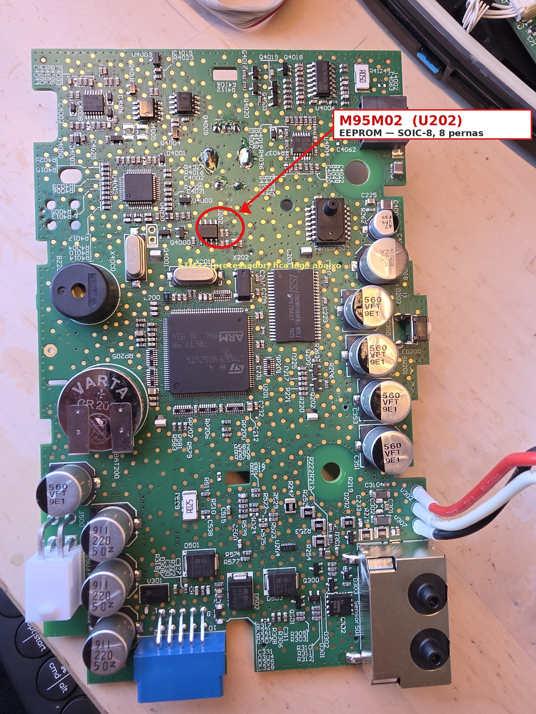
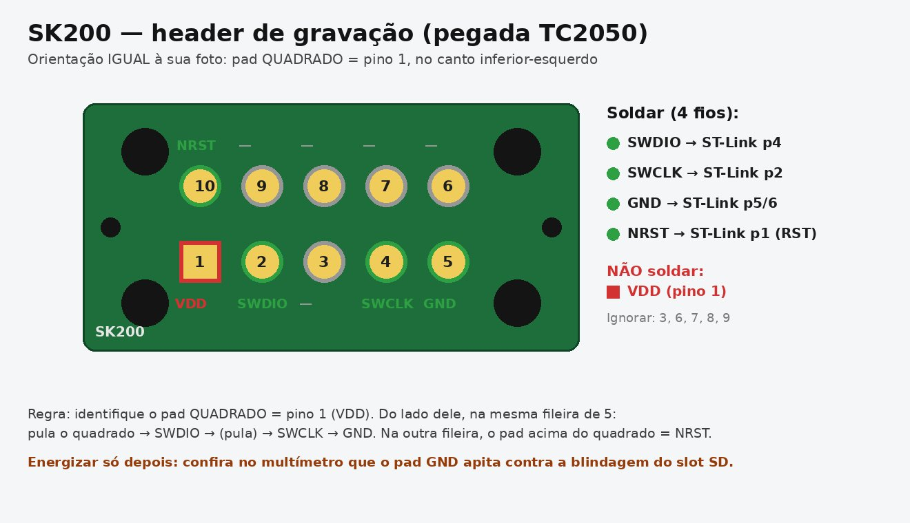
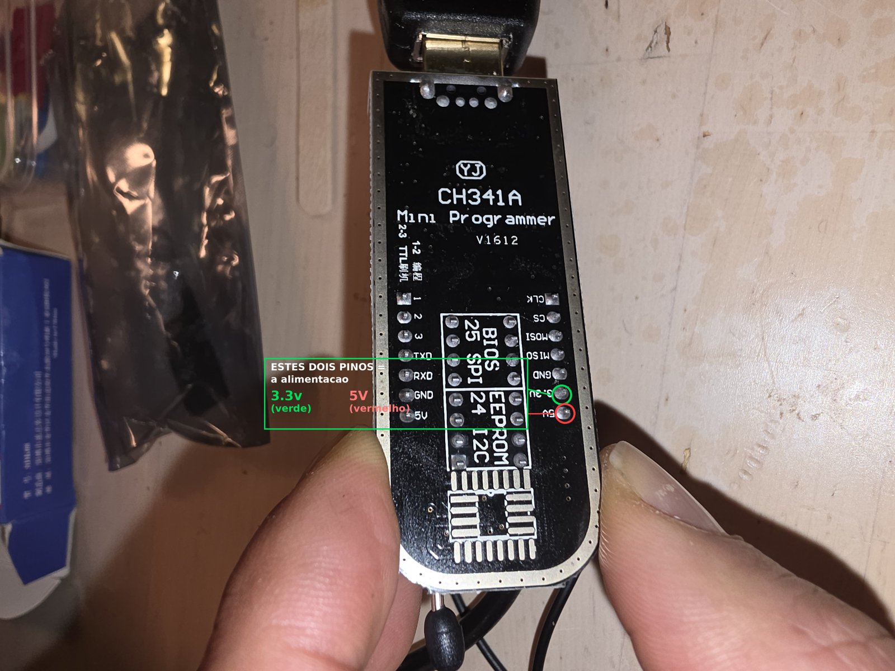
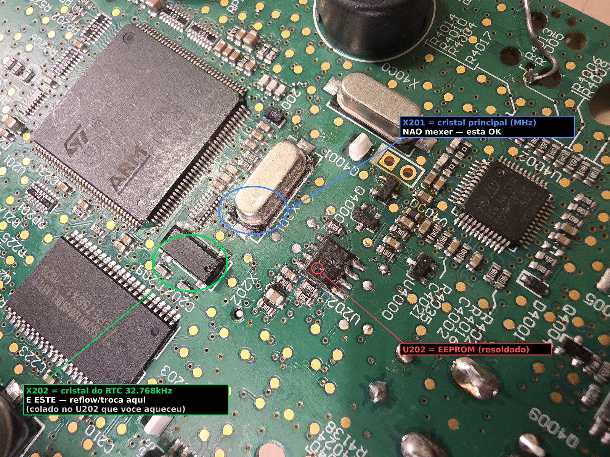

# Reverse-Engineering a ResMed AirSense 10 — SWD, EEPROM & the Hour Meters

A bench reverse-engineering writeup: dumping/patching the STM32 firmware, desoldering and reading the SPI EEPROM, decoding how the device stores its **run-hour meters** (seconds + CRC-16), and the delicate-crystal lesson I learned the hard way.

> **This is an educational hardware-RE project on my own retired, out-of-service unit.** Nothing here is proprietary ResMed code — the firmware was extracted from my own machine. The goal was to *learn the tools*: SWD, STM32 dump/flash, SMD desoldering, SPI-EEPROM read/write and binary-format analysis (structure + CRC).
>
> **Do not do this to a device in therapy use.** A CPAP/ventilator is a medical device. And please don't use hour-meter knowledge to misrepresent a used machine to a buyer — that's on you, not on the physics.
>
> Firmware side builds on the open-source [**AirBreak**](https://airbreak.dev) project ([osresearch/airbreak](https://github.com/osresearch/airbreak), [airbreak-plus](https://github.com/Asmageddon/airbreak-plus)). Credit to them.

---

## The platform

ResMed's **"S10"** family (AirSense 10, AirCurve 10, Lumis 10) shares one electronics platform:

| Part | Component |
|------|-----------|
| Main MCU | **STM32F405ZGT6** (Cortex-M4, LQFP144) |
| Aux MCU | STM8S005 |
| Serial EEPROM | **M95M02** (ST, SPI, 2 Mbit / 256 KB) |
| SWD access | `SK200` footprint (TC2050 / Tag-Connect) on the front of the board |
| RTC crystal | **32.768 kHz** (`X202`), right next to the EEPROM |

SWD pinout: `SWDIO = PA13`, `SWCLK = PA14`, `NRST = pin 25`.



---

## Part 1 — Firmware (via SWD)



1. Wire an **ST-Link V2** to the `SK200` SWD pads (SWDIO, SWCLK, GND, NRST).
2. **Dump** the firmware over SWD.
3. Apply the **AirBreak** unlock patches. My unit was a regional variant whose hash didn't match the project's reference, so I verified every patch offset against the binary *before* writing (a small self-checking patcher). 
4. **Re-flash.** Done.

> Note: AirBreak removes the motor-hours *nag screen* but does **not** reset the counter — that lives in the EEPROM, which is Part 2.

---

## Part 2 — The EEPROM & the hour meters

### 2.1 Reading it: in-circuit vs desoldered

**In-circuit reading works — no extra components needed.** No series resistors, no level shifting. The only prep: I tied the STM32's **NRST to ground** to hold the main MCU in reset, so it lets go of the SPI bus and doesn't fight the programmer (that's what kills an in-circuit read — bus contention). Then I read the M95M02 straight on the board with a CH341A + SOIC-8 clip. You get large runs of `FF` (the chip's unused space), but the part that matters — the header block with the hour meters — reads fine. (Interestingly, when you desolder the chip those `FF` runs don't show the same way; the live in-circuit read is how I first spotted the real data.)

**The one gotcha was a software-mode mistake, not wiring.** My early "IC not responding" / all-`FF` failures happened because I had the programmer set to the wrong mode — I thought it should be an **"EEPROM"** setting, when it actually needed the **25xx SPI ("BIOS" / flash) mode**. Once I switched to that, it read on the first try.



**Desoldering** is still the most bulletproof (zero bus contention) and it's what I used to first fully decode the format below — but you don't have to desolder just to read it.

### 2.2 Desoldering

Hot air alone (even at 400 °C) wouldn't release it — the copper planes sink the heat. What worked: **iron + leaded solder** piled onto each side into two blobs, then alternating the iron between them until both sides were molten and the chip slid off. Golden rule: only lift when *all* pins are liquid.

### 2.3 The structure (the interesting bit)

256 KB dump. It's a **FAT12 filesystem** holding ResMed's internal data files, plus a small **header block** at the very start. The run-hour meters live in that header, stored as **seconds** (uint32 LE) — and there are **four** of them, in the exact order of the firmware's persistent-state list (`HOU, MHR, MHU, MHS` per AirBreak's `var_reference.tsv`):

| Offset | Var | Meaning |
|--------|-----|---------|
| `0x0C` | **HOU** | Patient / "Used Hrs" (therapy actually delivered) |
| `0x10` | **MHR** | `MOTOR_HOUR` — "Run Hrs" (the one on screen) |
| `0x14` | **MHU** | `TOTAL_HOURS` |
| `0x18` | **MHS** | `MOTOR_HR_SRV` (hours since service) |
| `0x50` | — | **CRC-16 of the header** |

On a never-serviced unit MHR/MHU/MHS read the same value (they only diverge after a service reset) — so what looks like "triple redundancy" is actually three distinct meters that happen to coincide.

The header block `0x00–0x4F` is protected by a **CRC-16/CCITT-FALSE**:

```
poly = 0x1021, init = 0xFFFF, refin = false, refout = false, xorout = 0x0000
range = 0x00..0x4F, stored little-endian at 0x50
```

### 2.4 Editing

To change the motor hours:

1. Write `hours × 3600` (uint32 LE) at `0x10`, `0x14`, `0x18`.
2. Recompute the CRC-16/CCITT-FALSE over `0x00–0x4F`.
3. Store it (LE) at `0x50`.
4. Flash the image back to the chip.

Example: `2183 h → 7,860,187 s → DB EF 77 00`; zeroed → `00 00 00 00`.

After re-soldering and powering on, the **firmware accepted the edit and re-signed the block itself** (it updated its own timestamps and recomputed a fresh, valid CRC on boot) — which is the definitive proof the value was read, validated, and used.

```python
def crc16_ccitt_false(data: bytes) -> int:
    crc = 0xFFFF
    for b in data:
        crc ^= b << 8
        crc &= 0xFFFF
        for _ in range(8):
            crc = ((crc << 1) ^ 0x1021) & 0xFFFF if crc & 0x8000 else (crc << 1) & 0xFFFF
    return crc
```

---

## Part 3 — The lesson that cost a crystal

After all this, the device's **clock went erratic** (seconds jumping back and forth). It wasn't the EEPROM (the displayed date isn't stored there) and it wasn't the RTC backup battery (a soldered VARTA coin cell, healthy at 3 V).

It was the **32.768 kHz RTC crystal (`X202`)** — which sits *right against* the EEPROM I'd blasted with hot air. Heat near a crystal cracks/detunes it, and the RTC oscillator went unstable. The main MHz crystal (`X201`) survived (the machine boots fine); only the low-speed RTC oscillator died.

**Fix:** reflow it first; if dead, replace with a 3.2×1.5 mm 12.5 pF part (Abracon ABS07 / Epson FC-135). **Lesson #1 of rework: shield delicate crystals from hot air.**



---

## Quick reference

**Change the motor hours**
1. `hours × 3600` → uint32 LE at `0x10`, `0x14`, `0x18`.
2. Recompute CRC-16/CCITT-FALSE over `0x00–0x4F`.
3. Write LE at `0x50`; flash the image.

**Tools:** ST-Link V2 (SWD), CH341A + SOIC-8 clip / SOP-8 socket, NeoProgrammer, hot-air + iron, flux, multimeter.

---

## Notes on other models

The same approach should carry across the **S10** family:

- **AirSense 10** — firmware `SX567` (AirBreak's best-supported target).
- **Lumis 10 / VPAP** (bilevel/NIV ventilator) — firmware `SX584`, which AirBreak's tooling already partially handles (28-byte records, extra groups). The EEPROM hour-meter format is very likely identical. **A ventilator is more safety-critical — bench units only.**

---

## Credits

- [AirBreak](https://airbreak.dev) — osresearch, and the airbreak-plus contributors — for the firmware groundwork and the variable/register maps.
- Everyone on the CPAP/hardware forums who documented the S10 platform.

*Educational reverse-engineering. Your own hardware, at your own risk.*
